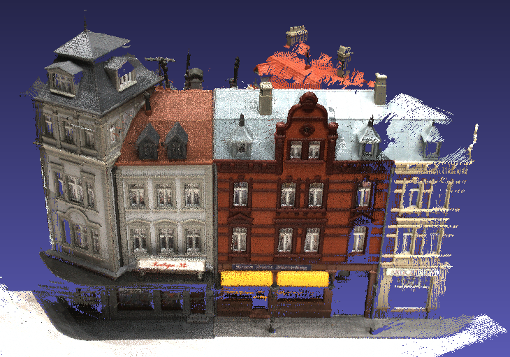

# MVSNet & R-MVSNet

<font color="red"> [News] BlendedMVS dataset is released!!!</font> ([project link](https://github.com/YoYo000/BlendedMVS)).

## About
[MVSNet](https://arxiv.org/abs/1804.02505) is a deep learning architecture for depth map inference from unstructured multi-view images, and [R-MVSNet](https://arxiv.org/abs/1902.10556) is its extension for scalable learning-based MVS reconstruction. If you find this project useful for your research, please cite:
```
@article{yao2018mvsnet,
  title={MVSNet: Depth Inference for Unstructured Multi-view Stereo},
  author={Yao, Yao and Luo, Zixin and Li, Shiwei and Fang, Tian and Quan, Long},
  journal={European Conference on Computer Vision (ECCV)},
  year={2018}
}
```
```
@article{yao2019recurrent,
  title={Recurrent MVSNet for High-resolution Multi-view Stereo Depth Inference},
  author={Yao, Yao and Luo, Zixin and Li, Shiwei and Shen, Tianwei and Fang, Tian and Quan, Long},
  journal={Computer Vision and Pattern Recognition (CVPR)},
  year={2019}
}
```
If [BlendedMVS dataset](https://github.com/YoYo000/BlendedMVS) is used in your research, please also cite:
```
@article{yao2020blendedmvs,
  title={BlendedMVS: A Large-scale Dataset for Generalized Multi-view Stereo Networks},
  author={Yao, Yao and Luo, Zixin and Li, Shiwei and Zhang, Jingyang and Ren, Yufan and Zhou, Lei and Fang, Tian and Quan, Long},
  journal={Computer Vision and Pattern Recognition (CVPR)},
  year={2020}
}
```

## How to Use

### Installation

* Check out the source code ```git clone https://github.com/YoYo000/MVSNet```
* Install cuda 9.0, cudnn 7.0 and python 2.7
* Install Tensorflow and other dependencies by ```sudo pip install -r requirements.txt```

### Download

* Preprocessed training/validation data: [BlendedMVS](https://drive.google.com/open?id=1ilxls-VJNvJnB7IaFj7P0ehMPr7ikRCb), [DTU](https://drive.google.com/file/d/1eDjh-_bxKKnEuz5h-HXS7EDJn59clx6V/view) and [ETH3D](https://drive.google.com/open?id=1eqcv0Urr-c3Of8RKmTLhXrY_5cZCUvu5). More training resources could be found in [BlendedMVS github page](https://github.com/YoYo000/BlendedMVS) 
* Preprocessed testing data: [DTU testing set](https://drive.google.com/open?id=135oKPefcPTsdtLRzoDAQtPpHuoIrpRI_), [ETH3D testing set](https://drive.google.com/open?id=1hGft7rEFnoSrnTjY_N6vp5j1QBsGcnBB), [Tanks and Temples testing set](https://drive.google.com/open?id=1YArOJaX9WVLJh4757uE8AEREYkgszrCo) and [training set](https://drive.google.com/open?id=1vOfxAMFJUalhZzydzJa1AluRhzG7ZxHS)
* Pretrained models: pretrained on [BlendedMVS](https://drive.google.com/open?id=1HacSpLl49xB77uBuI67ceZV9Rx_8wjPV), on [DTU](https://drive.google.com/open?id=1-1JyFT9ClqPO0kz0d_5I1_IHX05paS4h) and on [ETH3D](https://drive.google.com/open?id=1A3eZch06gkmvj-R0fasX6M_KNWGIOfYG)

### Training

* Enter mvsnet script folder: ``cd MVSNet/mvsnet``  
* Train MVSNet on BlendedMVS, DTU and ETH3D: <br>
``python train.py --regularization '3DCNNs' --train_blendedmvs --max_w 768 --max_h 576 --max_d 128 --online_augmentation``  <br>
``python train.py --regularization '3DCNNs' --train_dtu --max_w 640 --max_h 512 --max_d 128``  <br>
``python train.py --regularization '3DCNNs' --train_eth3d --max_w 896 --max_h 480 --max_d 128``  <br>
* Train R-MVSNet: <br>
``python train.py --regularization 'GRU' --train_blendedmvs --max_w 768 --max_h 576 --max_d 128 --online_augmentation``  <br>
``python train.py --regularization 'GRU' --train_dtu --max_w 640 --max_h 512 --max_d 128``  <br>
``python train.py --regularization 'GRU' --train_eth3d --max_w 896 --max_h 480 --max_d 128``  <br>
* Specify your input training data folders using  ``--blendedmvs_data_root``, ``--dtu_data_root`` and ``--eth3d_data_root``
* Specify your output log and model folders using ``--log_folder`` and  ``--model_folder``
* Switch from BlendeMVS to BlendedMVG by replacing  using  ``--train_blendedmvs`` with ``--train_blendedmvg``

### Validation

* Validate MVSNet on BlendedMVS, DTU and ETH3D: <br>
``python validate.py --regularization '3DCNNs' --validate_set blendedmvs --max_w 768 --max_h 576 --max_d 128``<br>
``python validate.py --regularization '3DCNNs' --validate_set dtu --max_w 640 --max_h 512 --max_d 128``<br>
``python validate.py --regularization '3DCNNs' --validate_set eth3d --max_w 896 --max_h 480 --max_d 128``<br>
* Validate R-MVSNet: <br>
``python validate.py --regularization 'GRU' --validate_set blendedmvs --max_w 768 --max_h 576 --max_d 128``<br>
``python validate.py --regularization 'GRU' --validate_set dtu --max_w 640 --max_h 512 --max_d 128``<br>
``python validate.py --regularization 'GRU' --validate_set eth3d --max_w 896 --max_h 480 --max_d 128``<br>
* Specify your input model check point using  ``--pretrained_model_ckpt_path`` and ``--ckpt_step``
* Specify your input training data folders using  ``--blendedmvs_data_root``, ``--dtu_data_root`` and ``--eth3d_data_root``
* Specify your output result file using ``--validation_result_path``

### Testing
* Download test data [scan9](https://drive.google.com/file/d/17ZoojQSubtzQhLCWXjxDLznF2vbKz81E/view?usp=sharing) and unzip it to ``TEST_DATA_FOLDER`` folder
* Run MVSNet (GTX1080Ti):  <br>
``python test.py --dense_folder TEST_DATA_FOLDER  --regularization '3DCNNs' --max_w 1152 --max_h 864 --max_d 192 --interval_scale 1.06``
* Run R-MVSNet (GTX1080Ti):  <br>
``python test.py --dense_folder TEST_DATA_FOLDER  --regularization 'GRU' --max_w 1600 --max_h 1200 --max_d 256 --interval_scale 0.8``
* Specify your input model check point using  ``--pretrained_model_ckpt_path`` and ``--ckpt_step``
* Specify your input dense folder using ``--dense_folder``
* Inspect the .pfm format outputs in ``TEST_DATA_FOLDER/depths_mvsnet`` using ``python visualize.py .pfm``. For example, the depth map and probability map for image `00000012` should look like:

   |  |  
:---------------------------------------:|:---------------------------------------:|:---------------------------------------:
reference image                          |depth map                                |  probability map 


### Post-Processing

R/MVSNet itself only produces per-view depth maps. To generate the 3D point cloud, we need to apply depth map filter/fusion for post-processing. As our implementation of this part is depended on the [Altizure](https://www.altizure.com/) internal library, currently we could not provide the corresponding code. Fortunately, depth map filter/fusion is a general step in MVS reconstruction, and there are similar implementations in other open-source MVS algorithms. We provide the script ``depthfusion.py`` to utilize [fusibile](https://github.com/kysucix/fusibile) for post-processing (thank Silvano Galliani for the excellent code!). 

To run the post-processing: 
* Check out the modified version fusibile ```git clone https://github.com/YoYo000/fusibile```
* Install fusibile by ```cmake .``` and ```make```, which will generate the executable at ``FUSIBILE_EXE_PATH``
* Run post-processing (--prob_threshold 0.8 if using 3DCNNs):
``python depthfusion.py --dense_folder TEST_DATA_FOLDER --fusibile_exe_path FUSIBILE_EXE_PATH --prob_threshold 0.3``
* The final point cloud is stored in `TEST_DATA_FOLDER/points_mvsnet/consistencyCheck-TIME/final3d_model.ply`.

We observe that ``depthfusion.py`` produce similar but quantitatively worse result to our own implementation. For detailed differences, please refer to [MVSNet paper](https://arxiv.org/abs/1804.02505) and [Galliani's paper](https://www.cv-foundation.org/openaccess/content_iccv_2015/papers/Galliani_Massively_Parallel_Multiview_ICCV_2015_paper.pdf). The point cloud for `scan9` should look like:


   |  
:--------------------------------------------------:|:----------------------------------------------:
point cloud result                          |ground truth point cloud


### Reproduce Paper Results

The following steps are required to reproduce depth map/point cloud results:

* Generate R/MVSNet inputs from SfM outputs.You can use our preprocessed testing data in the download section. (provided)
* Run R/MVSNet testing script to generate depth maps for all views (provided)
* Run R/MVSNet validation script to generate depth map validation results. (provided)
* Apply variational depth map refinement for all views (optional, not provided)
* Apply depth map filter and fusion to generate point cloud results (partially provided via fusibile)

R-MVSNet point cloud results with full post-processing are also provided: [DTU evaluation point clouds](https://drive.google.com/open?id=1L0sQjIVYu2hYjwpwbWSN8k42QhkQDjbQ) 


## File Formats

Each project folder should contain the following
```
.                          
├── images                 
│   ├── 00000000.jpg       
│   ├── 00000001.jpg       
│   └── ...                
├── cams                   
│   ├── 00000000_cam.txt   
│   ├── 00000001_cam.txt   
│   └── ...                
└── pair.txt               
```
If you want to apply R/MVSNet to your own data, please structure your data into such a folder. We also provide a simple script `colmap2mvsnet.py` to convert COLMAP SfM result to R/MVSNet input.

### Image Files
All image files are stored in the `images` folder. We index each image using an 8 digit number starting from `00000000`. The following camera and output files use the same indexes as well. 

### Camera Files
The camera parameter of one image is stored in a ``cam.txt`` file. The text file contains the camera extrinsic `E = [R|t]`, intrinsic `K` and the depth range:
```
extrinsic
E00 E01 E02 E03
E10 E11 E12 E13
E20 E21 E22 E23
E30 E31 E32 E33

intrinsic
K00 K01 K02
K10 K11 K12
K20 K21 K22

DEPTH_MIN DEPTH_INTERVAL (DEPTH_NUM DEPTH_MAX) 
```
Note that the depth range and depth resolution are determined by the minimum depth `DEPTH_MIN`, the interval between two depth samples `DEPTH_INTERVAL`, and also the depth sample number `DEPTH_NUM` (or `max_d` in the training/testing scripts if `DEPTH_NUM` is not provided). We also left the `interval_scale` for controlling the depth resolution. The maximum depth is then computed as:
```
DEPTH_MAX = DEPTH_MIN + (interval_scale * DEPTH_INTERVAL) * (max_d - 1)
``` 

### View Selection File
We store the view selection result in the `pair.txt`. For each reference image, we calculate its view selection scores with each of the other views, and store the 10 best views in the pair.txt file:
```
TOTAL_IMAGE_NUM
IMAGE_ID0                       # index of reference image 0 
10 ID0 SCORE0 ID1 SCORE1 ...    # 10 best source images for reference image 0 
IMAGE_ID1                       # index of reference image 1
10 ID0 SCORE0 ID1 SCORE1 ...    # 10 best source images for reference image 1 
...
``` 

### MVSNet input from SfM output
We provide a script to convert COLMAP SfM result to R/MVSNet input. After recovering SfM result and undistorting all images, COLMAP should generate a dense folder `COLMAP/dense/` containing an undistorted image folder `COLMAP/dense/images/` and an undistorted camera folder `COLMAP/dense/sparse/`. Then, you can apply the following script to generate the R/MVSNet input:

``python colmap2mvsnet.py --dense_folder COLMAP/dense``

The depth sample number will be automatically computed using the inverse depth setting. If you want to generate the MVSNet input with a fixed depth sample number (e.g., 256), you could specified the depth number via ``--max_d 256``.

### Output Format
The ``test.py`` script will create a `depths_mvsnet` folder to store the running results, including the depth maps, probability maps, scaled/cropped images and the corresponding cameras. The depth and probability maps are stored in `.pfm` format. We provide the python IO for pfm files in the `preprocess.py` script, and for the c++ IO, we refer users to the [Cimg](http://cimg.eu/) library. To inspect the pfm format results, you can simply type `python visualize.py .pfm`. 

## Changelog

### 2020 April 13
* Update BlendedMVG interface

### 2020 March 2
* Pretrained models on BlendedMVS, DTU and ETH3D (trained for 150000 iterations)
* Update instructions in ``README.md``

### 2020 Feb 29
* Training with BlendedMVS dataset
* Add `validate.py` script for depth map validation
* Add `photometric_augmentation.py` script for online augmentation durig training

### 2019 April 29
* Add `colmap2mvsnet.py` script to convert COLMAP SfM result to MVSNet input, including depth range estimation and view selection

### 2019 April 10
* Add [Baiduyun](https://pan.baidu.com/s/1Wb9E6BWCJu4wZfwxm_t4TQ#list/path=%2F) (code: s2v2) link for mainland China users

### 2019 March 14
* Add R-MVSNet point clouds of DTU evaluation set

### 2019 March 11
* Add "Reproduce Benchmarking Results" section

### 2019 March 7
* MVSNet/R-MVSNet training/testing scripts
* MVSNet and R-MVSNet models (trained for 100000 iterations)

### 2019 March 1 
* Implement R-MVSNet and GRU regularization
* Network change: enable scale and center in batch normalization
* Network change: replace UniNet with 2D UNet 
* Network change: use group normalization in R-MVSNet

### 2019 Feb 28 
* Use `tf.contrib.image.transform` for differentiable homography warping. Reconstruction is now x2 faster!

