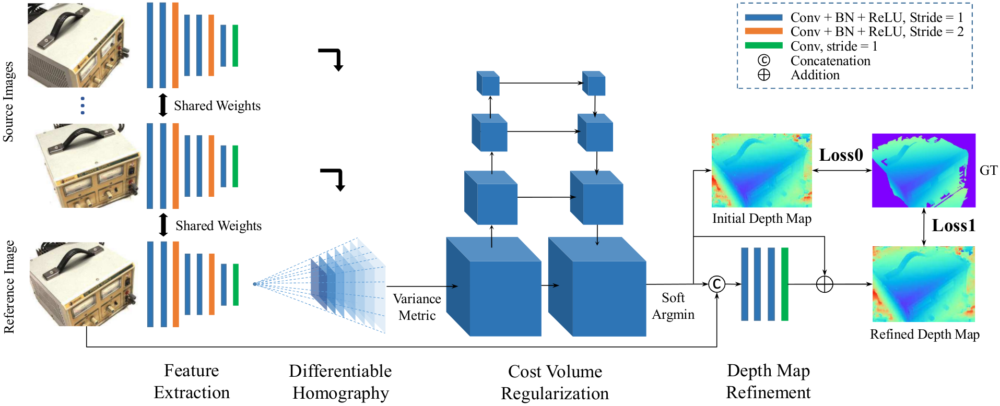
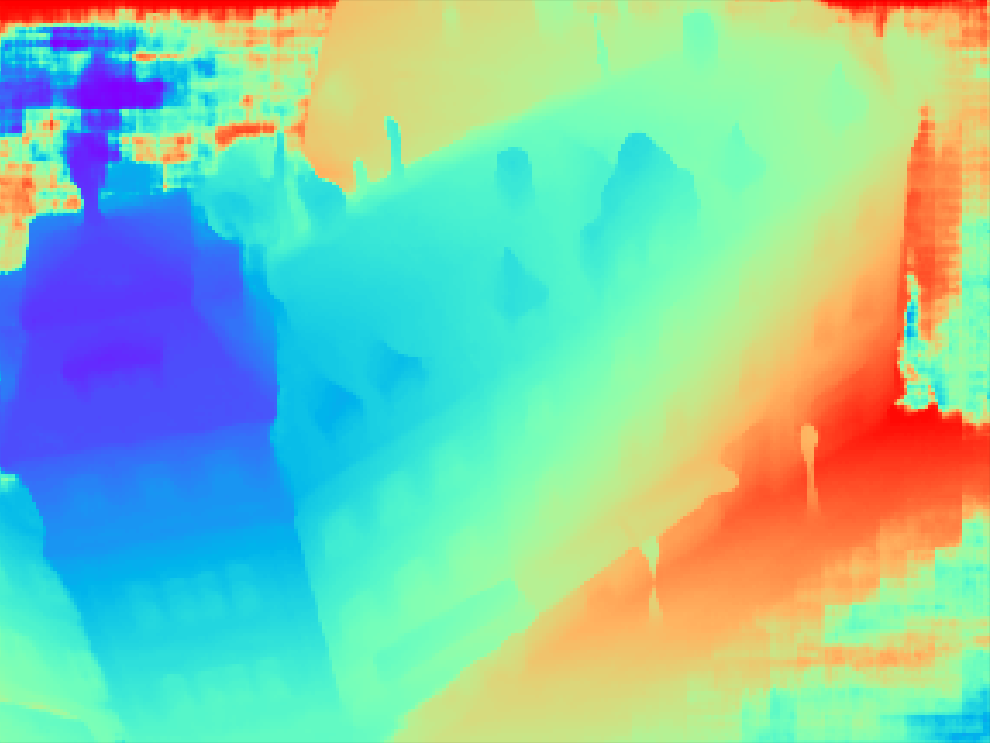
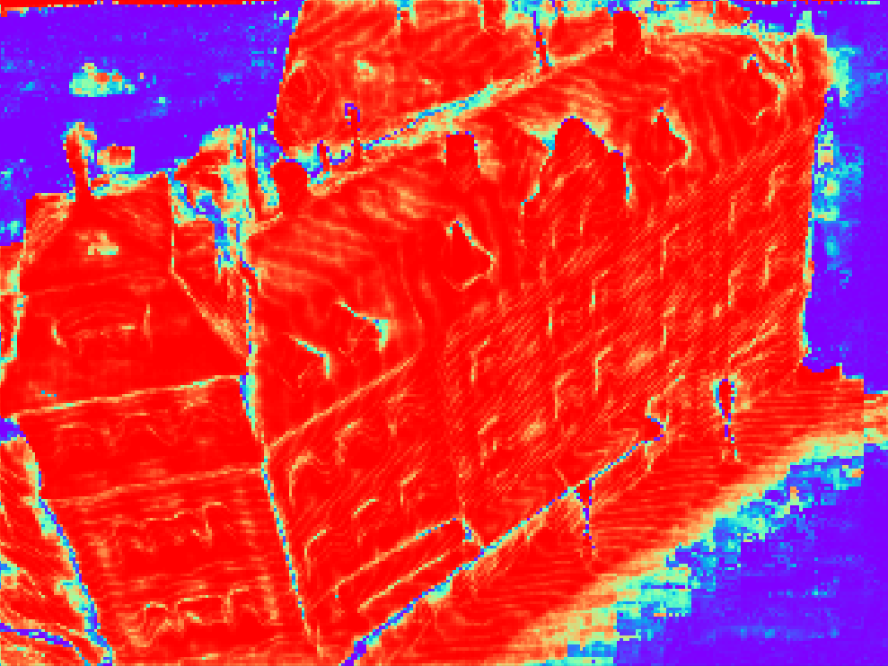

# MVSNet
<p align="center"></p>


## About
[MVSNet](https://arxiv.org/abs/1804.02505) is a deep learning architecture for depth map inference from unstructured multi-view images. If you find this project useful for your research, please cite:
```
@article{yao2018mvsnet,
  title={MVSNet: Depth Inference for Unstructured Multi-view Stereo},
  author={Yao, Yao and Luo, Zixin and Li, Shiwei and Fang, Tian and Quan, Long},
  journal={European Conference on Computer Vision (ECCV)},
  year={2018}
}
```

## How to Use

### Installation

* Check out the source code ```git clone https://github.com/YoYo000/MVSNet```
* Install cuda 9.0, cudnn 7.0 and python 2.7
* Install Tensorflow and other dependencies by ```sudo pip install -r requirements.txt```

### Training

* Download the preprocessed [DTU training data](https://drive.google.com/file/d/1dsGZxR9vQy4dY3wNzSwUWop-ZmQqouk1/view?usp=sharing) (see the paper), and upzip it as the ``MVS_TRANING`` folder.
* Enter the ``MVSNet/mvsnet`` folder, in ``train.py``, set ``dtu_data_root`` to your ``MVS_TRANING`` path.
* Create a log folder and a model folder in wherever you like to save the training outputs. Set the ``log_dir`` and ``save_dir`` in ``train.py`` correspondingly.
* Train the network ``python train.py``

### Testing

* Download the test data for [scan9](https://drive.google.com/file/d/17ZoojQSubtzQhLCWXjxDLznF2vbKz81E/view?usp=sharing) and unzip it as the ``TEST_DATA_FOLDER`` folder, which should contain one ``cams`` folder, one ``images`` folder and one ``pair.txt`` file.
* Download the pre-trained MVSNet [model](https://drive.google.com/file/d/1i20LF9q3Pti6YoT1Q-5Li-VNu55SBPQS/view?usp=sharing) and upzip it as ``MODEL_FOLDER``.
* Enter the ``MVSNet/mvsnet`` folder, in ``test.py``, set ``pretrained_model_ckpt_path`` to ``MODEL_FOLDER/model.ckpt``
* Test on this dataset ``python test.py --dense_folder TEST_DATA_FOLDER``.
* Inspect the .pfm format outputs in ``TEST_DATA_FOLDER/depths_mvsnet`` using ``python visualize.py .pfm``. For example the depth map and probability map for image `00000012` should look like:

   |  |  
:---------------------------------------:|:---------------------------------------:|:---------------------------------------:
reference image                          |depth map                                |  probability map 


### Post-Processing

MVSNet itself only produces per-view depth maps. To generate the 3D point cloud, we need to apply depth map filter/fusion for post-processing. As our implementation of this part is depended on the [Altizure](https://www.altizure.com/) internal library, currently we could not provide the corresponding code. Fortunately, depth map filter/fusion is a general step in MVS reconstruction, and there are similar implementations in other open-source MVS algorithms. We provide the script ``depthfusion.py`` to utilize [fusibile](https://github.com/kysucix/fusibile) for post-processing (thank Silvano Galliani for the excellent code!). 

To run the post-processing: 
* Check out the modified version fusibile ```git clone https://github.com/YoYo000/fusibile```
* Install fusibile by ```cmake .``` and ```make```, which will generate the executable at ``FUSIBILE_EXE_PATH``
* Run post-processing ``python depthfusion.py --dense_folder TEST_DATA_FOLDER --fusibile_exe_path FUSIBILE_EXE_PATH``
* The final point cloud is stored in `TEST_DATA_FOLDER/points_mvsnet/consistencyCheck-TIME/final3d_model.ply`.

We observe that the point cloud output of ``depthfusion.py`` is very similar to our own implementation. For detailed differences, please refer to [MVSNet paper](https://arxiv.org/abs/1804.02505) and [Galliani's paper](https://www.cv-foundation.org/openaccess/content_iccv_2015/papers/Galliani_Massively_Parallel_Multiview_ICCV_2015_paper.pdf)

## File Formats

Each project folder should contain the following
```
.                          
├── images                 
│   ├── 00000000.jpg       
│   ├── 00000001.jpg       
│   └── ...                
├── cams                   
│   ├── 00000000_cam.txt   
│   ├── 00000001_cam.txt   
│   └── ...                
└── pair.txt               
```
If you want to apply MVSNet to your own data, please structure your data into such a folder.

### Image Files
All image files are stored in the `images` folder. We index each image using an 8 digit number starting from `00000000`. The following camera and output files use the same indexes as well. 

### Camera Files
The camera parameter of one image is stored in a ``cam.txt`` file. The text file contains the camera extrinsic `E = [R|t]`, intrinsic `K` and the depth range:
```
extrinsic
E00 E01 E02 E03
E10 E11 E12 E13
E20 E21 E22 E23
E30 E31 E32 E33

intrinsic
K00 K01 K02
K10 K11 K12
K20 K21 K22

DEPTH_MIN DEPTH_INTERVAL
```
Note that the depth range and depth resolution are determined by the minimum depth `DEPTH_MIN`, the interval between two depth samples `DEPTH_INTERVAL`, and also the depth sample number (`max_d` in the training/testing scripts). The `max_d` is left in the scripts for users to flexibly control the depth range. We also left the `interval_scale` for controlling the depth resolution. The maximum depth is then computed as:
```
DEPTH_MAX = DEPTH_MIN + (interval_scale * DEPTH_INTERVAL) * (max_d - 1)
``` 

### View Selection File
We store the view selection result in the `pair.txt`. For each reference image, we calculate its view selection scores with each of the other views, and store the 10 best views in the pair.txt file:
```
TOTAL_IMAGE_NUM
IMAGE_ID0                       # index of reference image 0 
10 ID0 SCORE0 ID1 SCORE1 ...    # 10 best source images for reference image 0 
IMAGE_ID1                       # index of reference image 1
10 ID0 SCORE0 ID1 SCORE1 ...    # 10 best source images for reference image 1 
...
``` 


### Output Format
The ``test.py`` script will create a `depths_mvsnet` folder to store the running results, including the depth maps, probability maps, scaled/cropped images and the corresponding cameras. The depth and probability maps are stored in `.pfm` format. We provide the python IO for pfm files in the `preprocess.py` script, and for the c++ IO, we refer users to the [Cimg](http://cimg.eu/) library. To inspect the pfm format results, you can simply type `python visualize.py .pfm`. 


